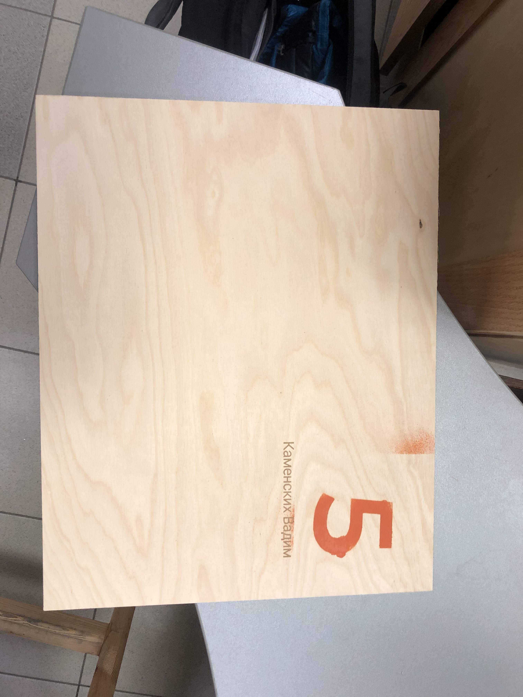
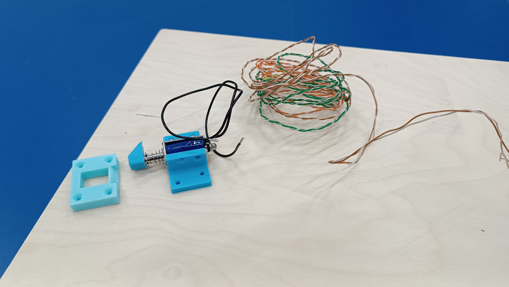
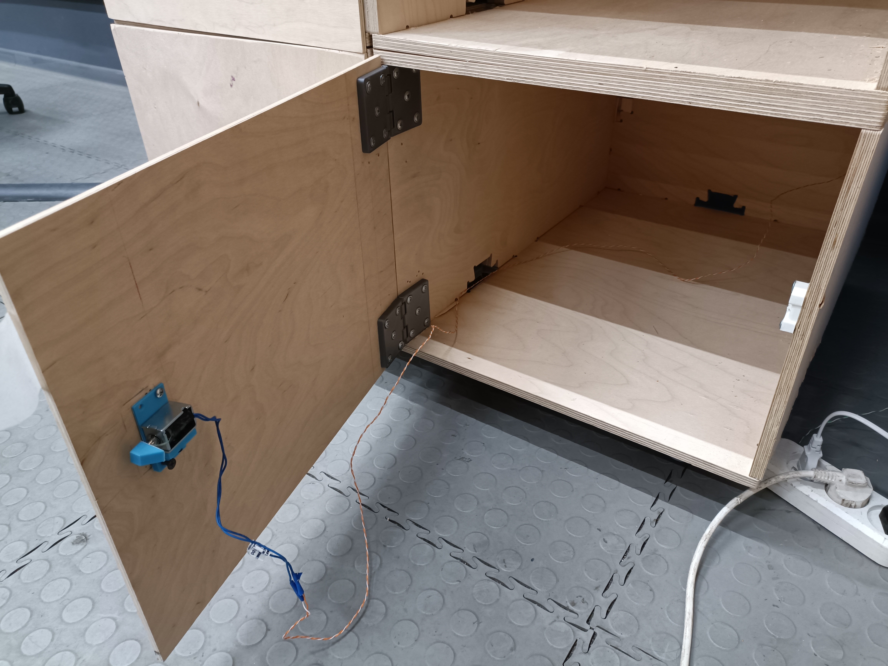

# Personal-loker
Creating a box with an electronic lock
Для создания использовалось следующее:
1. Лист фанеры 6мм;
2. Пруток PLA пластика;
3. Краска;
4. Фрезерный станок;
5. Лазерный гравер;
6. 3D принтер.
## Дверь
Дверь вырезали из листа фанеры 6мм на фрезернои станке. Размеры двери: высота - 35мм, ширина - 44мм. С помощью краски был присвоен номер ячейки, а лазерным гравером было выгравировано фамилия и имя владельца.

## Петли
Петли были распечатаны на 3D принтере в количестве двух штук. Модель была взята [отсюда](https://www.thingiverse.com/thing:4804593).
## Замок
В качастве замка используется соленоид:

## Сборка
С помощью петель крепим дверь к ячейке и закрепляем соленоид на противоположной стороне. В результате получаем следующее:

